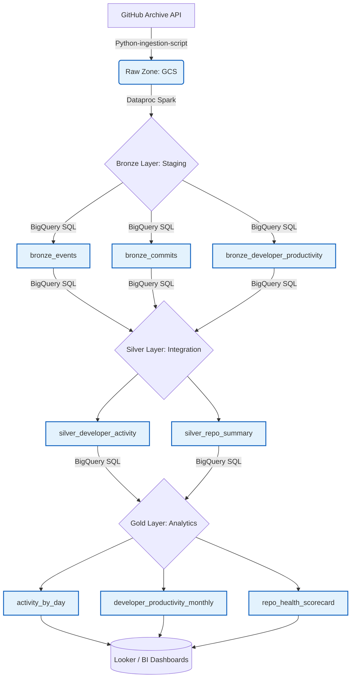

# 📊 GitHub Archive Data Engineering Pipeline

## 📖 Project Overview
The **GitHub Archive Data Engineering Pipeline** is an end-to-end, automated data platform designed to ingest, process, and analyze massive volumes of developer activity from the global GitHub Archive. 

By tracking billions of events across millions of repositories, this project provides deep, actionable insights into developer productivity, repository health, pull request (PR) lifecycles, and open-source contribution trends over time.

## 📐 Architecture & Data Flow



## 🛠️ Tech Stack
This project leverages a modern, scalable data stack built on **Google Cloud Platform (GCP)** and orchestrated via **Bruin**:

* **Orchestration:** **Bruin** (Handles dependency management, native variable injection, and daily DAG scheduling).
* **Ingestion:** **Python** (Custom multithreaded `concurrent.futures` scripts for high-throughput API extraction).
* **Storage (Data Lake):** **Google Cloud Storage (GCS)** (Stores raw, compressed `.json.gz` payloads partitioned by date).
* **Processing Engine 1:** **Google Cloud Dataproc (Apache Spark)** (Managed Spark cluster utilized for heavy lifting: reading massive, nested JSON files from GCS, flattening complex arrays, and performing distributed transformations).
* **Processing Engine 2:** **Google BigQuery** (Serves as the primary Data Warehouse, executing SQL-based merge strategies to power the Medallion Architecture).
* **Reporting/BI:** **Looker / BI Dashboards** (Powers the final visualizations).

---

## 🚰 Pipeline Design (Medallion Architecture)

The data flows through a strict, quality-controlled Medallion architecture:

### 1. Raw Zone (Data Lake)
* **Process:** Daily scheduled Bruin Python assets pull 24 hours of `.json.gz` payloads directly from the GitHub Archive.
* **Storage:** Data is partitioned chronologically into GCS (`gs://data-engineering-[ID]-dev-raw-zone/github_events/YYYY-MM-DD/`).

### 2. 🥉 Bronze Layer (Staging & Deduplication)
* **Process:** Dataproc (Spark) and BigQuery ingest the raw JSON data.
* **Transformations:** Enforces primary keys, non-null constraints, and deduplicates records using `QUALIFY ROW_NUMBER() = 1`. 
* **Tables Created:** Base events, Commit records, and Pull Request metrics.

### 3. 🥈 Silver Layer (Integration)
* **Process:** Unifies disparate GitHub actions into a cohesive timeline.
* **Transformations:** Merges Commits, PRs, and standard events into a master `silver_developer_activity` table and rolls data into daily repository summaries (`silver_repo_summary`).

### 4. 🥇 Gold Layer (Analytics & Reporting)
* **Process:** Highly aggregated, BI-ready tables optimized for fast dashboard rendering.
* **Transformations:** Calculates monthly developer productivity, merge rates, net lines of code (LOC), and repository health scores.

---

## 📈 Key Reports & Business Insights

Based on the final BI reporting layer, the pipeline successfully powers the following analytics across the **Jan 2024 - Dec 2025** dataset:

### 1. Developer & Repository Activity Tracking
* **Top Developers by Commits:** Identifies the most active contributors globally (e.g., `ttgds3asu`, `censameesss`), with top users pushing tens of millions of commits.
<div align="center">
  
</div>

* **Total Commits by Repository:** Tracks the busiest codebases (e.g., `githubdungchung/trigger`, `frdpzk2/ppub`), allowing for the identification of highly active or automated repositories.
<div align="center">
  
</div>

### 2. Event Distribution & Trends
* **The Dominance of Push Events:** The platform processed over **1.74 Billion PushEvents** (accounting for 65.1% of all activity), far outpacing Create Events (327M) and Pull Request Events (137M).
<div align="center">
  
</div>
<div align="center">
  
</div>

* **Time-Series Analysis:** Line charts track the daily volume of Push, Create, PR, and Watch events, showing a massive peak in activity around March-May before stabilizing.
<div align="center">
  
</div>

### 3. Developer Productivity & PR Analytics
* **Pull Request Volume:** Tracks the highest PR generators, notably highlighting heavy automation and AI presence (e.g., `direwolf-github`, `Copilot`, `aws-aemilia-pdx`).
<div align="center">
  
</div>

* **Merge Rate vs. PR Volume:** Scatter plots analyze developer efficiency by comparing total PR output against successful merge rates, identifying code review bottlenecks.
<div align="center">
  
</div>

* **Merged vs. Unmerged PRs:** Stacked bar charts provide a month-by-month breakdown of PR resolution, showing peak PR creation (and subsequent unmerged backlog) in March and April.
<div align="center">
  
</div>

### 4. Codebase Churn & PR Sizing
* **Average PR Size:** The data shows average PR sizes peaking at ~85 lines between May and August before dropping sharply toward the end of the year.
<div align="center">
  
</div>

* **Lines of Code (LOC) Churn:** The pipeline processed massive code additions peaking at nearly **60 Billion lines added** in early spring, compared to a steady ~20 Billion lines deleted, indicating aggressive codebase expansion phases.
<div align="center">
  
</div>

---

## 🚀 Local Execution & Setup

1. **Environment Configuration:** Create a `.env` file in the root directory. Ensure all connection strings, `BRUIN_START_DATE`, and `BRUIN_VARS` payloads are defined. **No hardcoded fallback values are permitted in the pipeline code.**
   
2. **Dependencies:** Sync your virtual environment using `uv` for rapid package installation:
   ```bash
   uv pip install requests google-cloud-storage python-dotenv
   ```
   
3. **GCP Authentication:** Ensure your environment is authenticated to access BigQuery, GCS, and Dataproc:
   ```bash
   gcloud auth application-default login
   ```
   
4. **Triggering the Run:** Execute the Bruin pipeline for a specific logical date:
   ```bash
   bruin run pipeline.yml --start-date 2024-01-01
   ```
